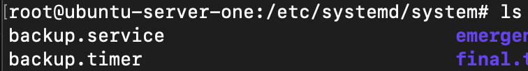
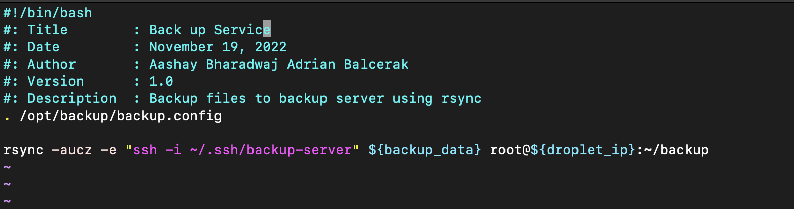
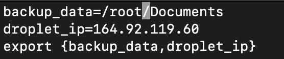
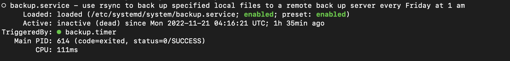
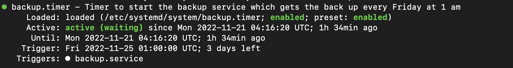

# ACIT 2420 Week 11 Lab: Back up Project

## Team Members 

### Aashay Bharadwaj
### Adrian Balcerak

# Description 
A script that backs up the specified files to a remote backup server

#### /opt/backup Directory Contents

#### /etc/systemd/system contents

# Getting Started
In order to begin with the Setup
1. Create a Directory /opt/backup using the command:        mkdir /opt/backup
3. Create a file called backup using the command:       touch backup
4. Open the file using the ***vim Editor***:        vim backup
5. Enter the following Code: 

6. In the ***Same Directory*** create backup.config file using touch command:       touch backup.config
7. Open the config file using vim editor and declare the following variables:

***Note: The backup_data variable can be cchanged to be any directory
   Droplet_ip is the ip address of the backup server***
   
# Setting up the Service and Timer
In order to regularly backup the data we can set a service a a timer that triggers it. 

### Set up service to backup data every Saturday at 1 am
To get started:
1. Navigate to /etc/systemd/system directory using:         cd /etc/systemd/system
2. Save ***backup.service and backup.timer*** in this directory
4. In order to activate the ***service and timer*** files:
    1. Run the following command:       sudo systemctl enable backup.service        to enable service file
    2. Run the following command:       sudo systemctl enable backup.timer      to enable timer file
5. In order to get the status of the ***service and timer***:
    1. Run the following command:       sudo systemctl status backup.service
    
    2. Run the following command:       sudo systemctl status backup.timer
    

#### Thats it now your system will auto backup the specified files every Saturday at 1 am
                                                                       
